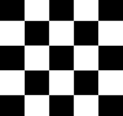
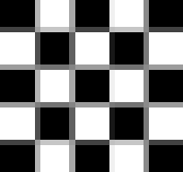

# Quadtree Image Compression

## Description
This project implements an image compression algorithm using the Quadtree data structure and a divide-and-conquer approach. The algorithm recursively divides an image into quadrants based on color uniformity, allowing for efficient compression while preserving important visual details.

## Features

- Multiple error measurement methods:
  - Variance
  - Mean Absolute Deviation (MAD)
  - Max Pixel Difference
  - Entropy
- Configurable threshold and minimum block size parameters
- Visual representation of compression results
- Detailed statistics including execution time, tree depth, node count, and compression percentage

## Requirements

- Java Development Kit (JDK) 8 or higher
- Compatible with Windows, Linux, and macOS

## Installation

1. Clone this repository:
   ```
   git clone https://github.com/<yourusername>/Tucil2_13523155.git
   ```

2. Navigate to the project directory:
   ```
   cd Tucil2_13523155
   ```

3. Compile the source code:
   ```
   mkdir -p bin
   javac -d bin src/*.java
   ```

## Usage

### Running the Program

Run the compiled program using:

```
java -cp bin QuadTreeCompression
```

### Input Parameters

The program will prompt you for several parameters:

1. **Input Image Path**: Absolute path to the image you want to compress
2. **Error Measurement Method**:
   - 1: Variance
   - 2: Mean Absolute Deviation (MAD)
   - 3: Max Pixel Difference
   - 4: Entropy
3. **Threshold Value**: Determines when a block should be divided (higher values result in more compression but lower quality)
4. **Minimum Block Size**: Smallest allowable block size (prevents over-division of the image)
5. **Output Image Path**: Where to save the compressed image

### Recommended Parameter Values

| Image Type | Error Method | Threshold | Min Block Size |
|------------|--------------|-----------|----------------|
| Simple drawings | Variance | 30-100 | 8-16 |
| Photos | Entropy | 0.5-2.0 | 4-8 |
| High contrast | Max Pixel Difference | 20-50 | 4-8 |
| Smooth gradients | MAD | 5-20 | 8-16 |

## Implementation Details

### Algorithm Overview

The Quadtree compression algorithm follows these steps:

1. **Divide**: Check if a block's error exceeds the threshold
2. **Conquer**: If it does, divide into four sub-blocks and process recursively
3. **Combine**: If not, represent the entire block with its average color

## Project Structure

```
Tucil2_13523155/
├── src/
│   ├── QuadTreeCompression.java  // Main program class
│   ├── QuadTreeNode.java         // Node representation class
│   ├── ErrorMeasurement.java     // Error measurement interface
│   ├── ErrorMeasurementImpl.java // Error calculation implementations
│   └── ImageProcessor.java       // Image processing utilities
├── bin/                          // Compiled .class files
├── test/                         // Test images and results
├── doc/                          // Documentation
└── README.md                     // This file
```

## Example Results

### Example 1: Checkboard Pattern

Input Image             |  Compressed Result
:-------------------------:|:-------------------------:
  |  

- **Error Method**: Max Pixel Difference
- **Threshold**: 10.0
- **Min Block Size**: 4
- **Results**:
  - Tree Depth: 6
  - Number of Nodes: 725
  - Execution Time: 44 ms

### Example 2: Solid Color

Input Image             |  Compressed Result
:-------------------------:|:-------------------------:
  |  

- **Error Method**: Entropy
- **Threshold**: 2.0
- **Min Block Size**: 4
- **Results**:
  - Tree Depth: 1
  - Number of Nodes: 1
  - Execution Time: 18 ms

### Example 3: Natural Image

Input Image             |  Compressed Result
:-------------------------:|:-------------------------:
  |  

- **Error Method**: Mean Absolute Deviation (MAD)
- **Threshold**: 2
- **Min Block Size**: 16
- **Results**:
  - Tree Depth: 7
  - Number of Nodes: 5321
  - Execution Time: 515 ms

## Performance Considerations

- Lower threshold values result in better quality but larger file sizes
- Higher minimum block sizes improve compression but may reduce quality
- The Entropy error method generally gives the most perceptually accurate results

## Known Issues

- Some colors might appear darker/lighter in the compressed image
- For some images, the compressed image may take up bigger space than the original

## Author

- Student Name: M. Abizzar Gamadrian
- Student ID: 13523155
- Program Studi Teknik Informatika
- Sekolah Teknik Elektro dan Informatika
- Institut Teknologi Bandung

## License

This project is submitted as part of the "Tugas Kecil 2 IF2211 Strategi Algoritma" course assignment.
